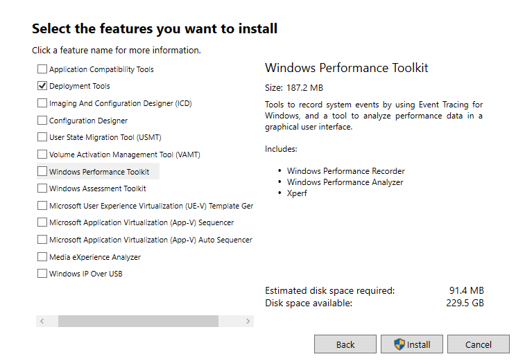
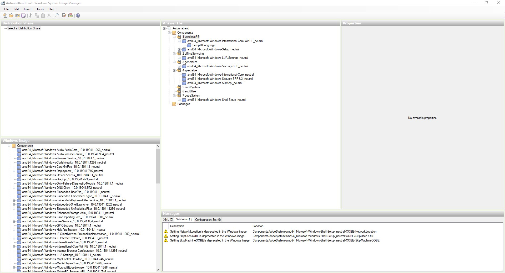
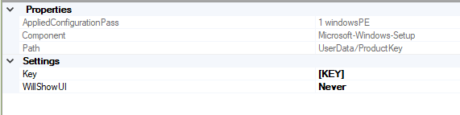

+++
author = "Robert Fulscher"
title = "Windows Autounattend.xml Guide"
date = "2022-09-28"
description = "Guide for creating and customizing Autounattend.xml files"
tags = [
    "Windows",
    "Automation",
    "Autounattend",
    "Scripts",
]
categories = [
    "Windows",
    "Automation",
]
image = "usb-hdd-desk.jpg"
+++

## Windows Autounattend History
unattend files have been in use for a long time, all the way back to windows xp. They allow you to skip the repetitive task of setting up a new computer and installing windows with minimal user interaction. Using a simple XML file to tell windows exactly what you want to do everything from formatting the hard drive to setting up users and even running scripts at first login.

## Overview
We will go over the easiest way to get a starter xml file and customizing it to our needs with windows system image manager. I will also go over how to get the answer file to use the windows key that is stored in the bios of many computer's.

## Starter Autounattend.xml
The easiest way to get a basic xml file with a lot of the work already done is to go to https://www.windowsafg.com/. An amazing website that lets you easily fill in the info and get a basic file that is perfect to start with. Navigate to the version of windows you want to generate a file for I chose windows 10 UEFI. Fill out the file to what you want I recommend leaving the computer name and password blank. When we plug the file into WSIM we can set the password and windows will hash the password as to not leave a plain text password in the file. The file I generated is bellow I trimmed the comments as they are not needed and can sometimes cause the install to fail. Copy the xml and save it for editing later make sure its named Autounattend.xml.

```xml
<?xml version="1.0" encoding="utf-8"?>
<unattend xmlns="urn:schemas-microsoft-com:unattend">
<settings pass="windowsPE">
<component name="Microsoft-Windows-International-Core-WinPE" processorArchitecture="amd64" publicKeyToken="31bf3856ad364e35" language="neutral" versionScope="nonSxS" xmlns:wcm="http://schemas.microsoft.com/WMIConfig/2002/State" xmlns:xsi="http://www.w3.org/2001/XMLSchema-instance">
<SetupUILanguage>
<UILanguage>en-US</UILanguage>
</SetupUILanguage>
<InputLocale>0409:00000409</InputLocale>
<SystemLocale>en-US</SystemLocale>
<UILanguage>en-US</UILanguage>
<UILanguageFallback>en-US</UILanguageFallback>
<UserLocale>en-US</UserLocale>
</component>
<component name="Microsoft-Windows-Setup" processorArchitecture="amd64" publicKeyToken="31bf3856ad364e35" language="neutral" versionScope="nonSxS" xmlns:wcm="http://schemas.microsoft.com/WMIConfig/2002/State" xmlns:xsi="http://www.w3.org/2001/XMLSchema-instance">
<DiskConfiguration>
<Disk wcm:action="add">
<DiskID>0</DiskID>
<WillWipeDisk>true</WillWipeDisk>
<CreatePartitions>
<CreatePartition wcm:action="add">
<Order>1</Order>
<Type>Primary</Type>
<Size>300</Size>
</CreatePartition>
<CreatePartition wcm:action="add">
<Order>2</Order>
<Type>EFI</Type>
<Size>100</Size>
</CreatePartition>
<CreatePartition wcm:action="add">
<Order>3</Order>
<Type>MSR</Type>
<Size>128</Size>
</CreatePartition>
<CreatePartition wcm:action="add">
<Order>4</Order>
<Type>Primary</Type>
<Extend>true</Extend>
</CreatePartition>
</CreatePartitions>
<ModifyPartitions>
<ModifyPartition wcm:action="add">
<Order>1</Order>
<PartitionID>1</PartitionID>
<Label>WINRE</Label>
<Format>NTFS</Format>
<TypeID>DE94BBA4-06D1-4D40-A16A-BFD50179D6AC</TypeID>
</ModifyPartition>
<ModifyPartition wcm:action="add">
<Order>2</Order>
<PartitionID>2</PartitionID>
<Label>System</Label>
<Format>FAT32</Format>
</ModifyPartition>
<ModifyPartition wcm:action="add">
<Order>3</Order>
<PartitionID>3</PartitionID>
</ModifyPartition>
<ModifyPartition wcm:action="add">
<Order>4</Order>
<PartitionID>4</PartitionID>
<Label>OS</Label>
<Letter>C</Letter>
<Format>NTFS</Format>
</ModifyPartition>
</ModifyPartitions>
</Disk>
</DiskConfiguration>
<ImageInstall>
<OSImage>
<InstallTo>
<DiskID>0</DiskID>
<PartitionID>4</PartitionID>
</InstallTo>
<InstallToAvailablePartition>false</InstallToAvailablePartition>
</OSImage>
</ImageInstall>
<UserData>
<ProductKey>
<Key></Key>
<WillShowUI>Never</WillShowUI>
</ProductKey>
<AcceptEula>true</AcceptEula>
<FullName>Robert</FullName>
<Organization></Organization>
</UserData>
</component>
</settings>
<settings pass="offlineServicing">
<component name="Microsoft-Windows-LUA-Settings" processorArchitecture="amd64" publicKeyToken="31bf3856ad364e35" language="neutral" versionScope="nonSxS" xmlns:wcm="http://schemas.microsoft.com/WMIConfig/2002/State" xmlns:xsi="http://www.w3.org/2001/XMLSchema-instance">
<EnableLUA>false</EnableLUA>
</component>
</settings>
<settings pass="generalize">
<component name="Microsoft-Windows-Security-SPP" processorArchitecture="amd64" publicKeyToken="31bf3856ad364e35" language="neutral" versionScope="nonSxS" xmlns:wcm="http://schemas.microsoft.com/WMIConfig/2002/State" xmlns:xsi="http://www.w3.org/2001/XMLSchema-instance">
<SkipRearm>1</SkipRearm>
</component>
</settings>
<settings pass="specialize">
<component name="Microsoft-Windows-International-Core" processorArchitecture="amd64" publicKeyToken="31bf3856ad364e35" language="neutral" versionScope="nonSxS" xmlns:wcm="http://schemas.microsoft.com/WMIConfig/2002/State" xmlns:xsi="http://www.w3.org/2001/XMLSchema-instance">
<InputLocale>0409:00000409</InputLocale>
<SystemLocale>en-US</SystemLocale>
<UILanguage>en-US</UILanguage>
<UILanguageFallback>en-US</UILanguageFallback>
<UserLocale>en-US</UserLocale>
</component>
<component name="Microsoft-Windows-Security-SPP-UX" processorArchitecture="amd64" publicKeyToken="31bf3856ad364e35" language="neutral" versionScope="nonSxS" xmlns:wcm="http://schemas.microsoft.com/WMIConfig/2002/State" xmlns:xsi="http://www.w3.org/2001/XMLSchema-instance">
<SkipAutoActivation>true</SkipAutoActivation>
</component>
<component name="Microsoft-Windows-SQMApi" processorArchitecture="amd64" publicKeyToken="31bf3856ad364e35" language="neutral" versionScope="nonSxS" xmlns:wcm="http://schemas.microsoft.com/WMIConfig/2002/State" xmlns:xsi="http://www.w3.org/2001/XMLSchema-instance">
<CEIPEnabled>0</CEIPEnabled>
</component>
<component name="Microsoft-Windows-Shell-Setup" processorArchitecture="amd64" publicKeyToken="31bf3856ad364e35" language="neutral" versionScope="nonSxS" xmlns:wcm="http://schemas.microsoft.com/WMIConfig/2002/State" xmlns:xsi="http://www.w3.org/2001/XMLSchema-instance">
<ComputerName></ComputerName>
<ProductKey>W269N-WFGWX-YVC9B-4J6C9-T83GX</ProductKey>
</component>
</settings>
<settings pass="oobeSystem">
<component name="Microsoft-Windows-Shell-Setup" processorArchitecture="amd64" publicKeyToken="31bf3856ad364e35" language="neutral" versionScope="nonSxS" xmlns:wcm="http://schemas.microsoft.com/WMIConfig/2002/State" xmlns:xsi="http://www.w3.org/2001/XMLSchema-instance">
<AutoLogon>
<Password>
<Value></Value>
<PlainText>true</PlainText>
</Password>
<Enabled>true</Enabled>
<Username>Robert</Username>
</AutoLogon>
<OOBE>
<HideEULAPage>true</HideEULAPage>
<HideOEMRegistrationScreen>true</HideOEMRegistrationScreen>
<HideOnlineAccountScreens>true</HideOnlineAccountScreens>
<HideWirelessSetupInOOBE>true</HideWirelessSetupInOOBE>
<NetworkLocation>Work</NetworkLocation>
<SkipUserOOBE>true</SkipUserOOBE>
<SkipMachineOOBE>true</SkipMachineOOBE>
<ProtectYourPC>1</ProtectYourPC>
</OOBE>
<UserAccounts>
<LocalAccounts>
<LocalAccount wcm:action="add">
<Password>
<Value></Value>
<PlainText>true</PlainText>
</Password>
<Description></Description>
<DisplayName>Robert</DisplayName>
<Group>Administrators</Group>
<Name>Robert</Name>
</LocalAccount>
</LocalAccounts>
</UserAccounts>
<RegisteredOrganization></RegisteredOrganization>
<RegisteredOwner>Robert</RegisteredOwner>
<DisableAutoDaylightTimeSet>false</DisableAutoDaylightTimeSet>
<FirstLogonCommands>
<SynchronousCommand wcm:action="add">
<Description>Control Panel View</Description>
<Order>1</Order>
<CommandLine>reg add "HKEY_CURRENT_USER\Software\Microsoft\Windows\CurrentVersion\Explorer\ControlPanel" /v StartupPage /t REG_DWORD /d 1 /f</CommandLine>
<RequiresUserInput>true</RequiresUserInput>
</SynchronousCommand>
<SynchronousCommand wcm:action="add">
<Order>2</Order>
<Description>Control Panel Icon Size</Description>
<RequiresUserInput>false</RequiresUserInput>
<CommandLine>reg add "HKEY_CURRENT_USER\Software\Microsoft\Windows\CurrentVersion\Explorer\ControlPanel" /v AllItemsIconView /t REG_DWORD /d 0 /f</CommandLine>
</SynchronousCommand>
<SynchronousCommand wcm:action="add">
<Order>3</Order>
<RequiresUserInput>false</RequiresUserInput>
<CommandLine>cmd /C wmic useraccount where name="Robert" set PasswordExpires=false</CommandLine>
<Description>Password Never Expires</Description>
</SynchronousCommand>
</FirstLogonCommands>
<TimeZone>Central Standard Time</TimeZone>
</component>
</settings>
</unattend>
```

## Install Windows System Image Manager
The tool with a long and unassuming name is actually very useful once get the hang of it. you can download it from the [Windows ADK](https://learn.microsoft.com/en-us/windows-hardware/get-started/adk-install). choose the installer for the windows version you plan to install I am using the windows 10 version 2004 and later. run the install and you will only need the deployment toolkit that is what comes with WSIM.


## Download Windows ISO
I'm sure you know how to get a windows iso but something that you may not know is windows has 2 different formats for the main install file. They have the .wim and .esp, if you use the windows media creation tool you will get an iso with a .esp file and will need to convert it to a .wim file to use it with WSIM. For some reason Microsoft hides the best way to download an iso and only lets you see it if your using a linux or mac os. To get past this go to the download page [Windows 10 Download](https://www.microsoft.com/en-us/software-download/windows10) and just trick the website into thinking your using a mac. You can do this in chrome by going to Developer Tools/Sources click the three dots and then more tools/network conditions. unselect the use browser default under user agent and select Chrome - Mac. Then refresh the page and you will be greeted with a download link to a direct iso download with a .wim file as the install file.

## WSIM
The official windows tool to create and edit Autounattend files, it has a lot of option's and can be a little confusing at first glance. Once you get used to WSIM it can be easy to add/remove feature's and get your deployment off the ground with little effort.
Once you open WSIM go to file and open the answer file we generated earlier and you will also need to right click on the windows image pane to add your install.wim file. the file is located in the windows iso you downloaded sources/install.wim when that load's WSIM should look like this.


Now look at all those options, luckily the file we generated did most of the work for us. Feel free to poke around and look through the options on the windows image pane. You can add all kinds of custom settings that way and the best resource for finding what they do is [Microsoft Docs](https://learn.microsoft.com/en-us/windows-hardware/customize/desktop/unattend/components-b-unattendicrosoft) There you will find more info on all the custom options used for creating an unattend file.

## Customization Tips
Our goal is to get a minimal touch install that will run a  bootstrap script to further customize the install. There are a few things we'll need to know about the machine we intend to deploy too. First thing is what kind of device are we deploying, if it's a OEM workstation from lenovo or dell it will have a windows key imbedded in the bios and we can use that to activate windows. We also need to know how many drives are in the system. If there is only one drive we can use the disk configuration section to wipe all the drives and install windows automatically. If there are more than one I would recommend just removing the disk configuration section, from my experience the unattend file will fail to select the proper drive to install to and could wipe a drive that you don't intend to. In that case its just easier to select that stuff manually to avoid failing out of the unattended install.
You can also set a password in WSIM for the user and for autologin if you save the file it will encode the password into Base64. This is a nice feature but wont stop anyone who is determined from decoding the string and reading the password. I would recommend not setting the password to anything that is used for anything critical or sensitive. also don't store the answer file anywhere that can be easily accessed.

## Install With Bios Product Key
To get windows to grab the key from the bios, that is in most OEM machines such as dell and lenovo is pretty easy. All you need to do is set the product key value to "[KEY]" in amd64_Microsoft-Windows-Setup_neutral/UserData/ProductKey. It should look like this

We also need to make sure to remove the Productkey value is blank in amd64_Microsoft-Windows-Shell-Setup_neatural under 4 specialize section. It will only work if the key is set in the one location.
If you are using a machine such as a vm or a machine with no key, you can leave the key as is. The file we generated uses a temp key from Microsoft that will let you install windows unattended without activating windows. you can also use the above setup and if it cannot find a key it will show the dialog box to enter a key, and you can just select 'I have no windows key' and the unattended install will continue without issue.

## Removing Disk Configuration
If the computer your deploying has multiple drives or you don't know the drive array, it is usually best to remove the disk configuration section. This way we can avoid errors and make sure the drives are setup properly. all you will need to do is remove this section from the unattended file
```xml
            <DiskConfiguration>
                <Disk wcm:action="add">
                    <DiskID>0</DiskID>
                    <WillWipeDisk>true</WillWipeDisk>
                    <CreatePartitions>
                        <CreatePartition wcm:action="add">
                            <Order>1</Order>
                            <Type>Primary</Type>
                            <Size>300</Size>
                        </CreatePartition>
                        <CreatePartition wcm:action="add">
                            <Order>2</Order>
                            <Type>EFI</Type>
                            <Size>100</Size>
                        </CreatePartition>
                        <CreatePartition wcm:action="add">
                            <Order>3</Order>
                            <Type>MSR</Type>
                            <Size>128</Size>
                        </CreatePartition>
                        <CreatePartition wcm:action="add">
                            <Order>4</Order>
                            <Type>Primary</Type>
                            <Extend>true</Extend>
                        </CreatePartition>
                    </CreatePartitions>
                    <ModifyPartitions>
                        <ModifyPartition wcm:action="add">
                            <Order>1</Order>
                            <PartitionID>1</PartitionID>
                            <Label>WINRE</Label>
                            <Format>NTFS</Format>
                            <TypeID>DE94BBA4-06D1-4D40-A16A-BFD50179D6AC</TypeID>
                        </ModifyPartition>
                        <ModifyPartition wcm:action="add">
                            <Order>2</Order>
                            <PartitionID>2</PartitionID>
                            <Label>System</Label>
                            <Format>FAT32</Format>
                        </ModifyPartition>
                        <ModifyPartition wcm:action="add">
                            <Order>3</Order>
                            <PartitionID>3</PartitionID>
                        </ModifyPartition>
                        <ModifyPartition wcm:action="add">
                            <Order>4</Order>
                            <PartitionID>4</PartitionID>
                            <Label>OS</Label>
                            <Letter>C</Letter>
                            <Format>NTFS</Format>
                        </ModifyPartition>
                    </ModifyPartitions>
                </Disk>
            </DiskConfiguration>
            <ImageInstall>
                <OSImage>
                    <InstallTo>
                        <DiskID>0</DiskID>
                        <PartitionID>4</PartitionID>
                    </InstallTo>
                    <InstallToAvailablePartition>false</InstallToAvailablePartition>
                </OSImage>
            </ImageInstall>
```

It will show a couple more dialog boxes during initial setup but will also save you a lot of headache trying to figure out why the install is failing.

## Run Scripts at First Login
You can setup the file to run commands or scripts at first login, this is perfect for running a bootstrap config script to finish customizing windows. You can add commands in the oobeSystem section under FirstLoginCommands and add synchronous command. I like having it run scripts from a network share drive. There is one problem with doing this, a lot of the time when windows first boot's it takes a minute for the network connection to initialize. To get around that I just have it run a powershell  command to sleep for 2 mins then it will continue to run the rest of the scripts/commands. After that you can have it install programs or run scripts that sitting on your network drive making it easy to make changes or add onto the install script.

## Final Autounattend.xml File
After all that my file look like this, this will get you past a lot of the repetitive tasks for installing windows. That way we can focus on other stuff, like finding more things to automate with scripting.
```xml
<?xml version="1.0" encoding="utf-8"?>
<unattend xmlns="urn:schemas-microsoft-com:unattend">
    <settings pass="windowsPE">
        <component name="Microsoft-Windows-International-Core-WinPE" processorArchitecture="amd64" publicKeyToken="31bf3856ad364e35" language="neutral" versionScope="nonSxS" xmlns:wcm="http://schemas.microsoft.com/WMIConfig/2002/State" xmlns:xsi="http://www.w3.org/2001/XMLSchema-instance">
            <SetupUILanguage>
                <UILanguage>en-US</UILanguage>
            </SetupUILanguage>
            <InputLocale>0409:00000409</InputLocale>
            <SystemLocale>en-US</SystemLocale>
            <UILanguage>en-US</UILanguage>
            <UILanguageFallback>en-US</UILanguageFallback>
            <UserLocale>en-US</UserLocale>
        </component>
        <component name="Microsoft-Windows-Setup" processorArchitecture="amd64" publicKeyToken="31bf3856ad364e35" language="neutral" versionScope="nonSxS" xmlns:wcm="http://schemas.microsoft.com/WMIConfig/2002/State" xmlns:xsi="http://www.w3.org/2001/XMLSchema-instance">
            <UserData>
                <ProductKey>
                    <Key>[KEY]</Key>
                    <WillShowUI>OnError</WillShowUI>
                </ProductKey>
                <AcceptEula>true</AcceptEula>
                <FullName>Robert</FullName>
                <Organization></Organization>
            </UserData>
        </component>
    </settings>
    <settings pass="offlineServicing">
        <component name="Microsoft-Windows-LUA-Settings" processorArchitecture="amd64" publicKeyToken="31bf3856ad364e35" language="neutral" versionScope="nonSxS" xmlns:wcm="http://schemas.microsoft.com/WMIConfig/2002/State" xmlns:xsi="http://www.w3.org/2001/XMLSchema-instance">
            <EnableLUA>false</EnableLUA>
        </component>
    </settings>
    <settings pass="generalize">
        <component name="Microsoft-Windows-Security-SPP" processorArchitecture="amd64" publicKeyToken="31bf3856ad364e35" language="neutral" versionScope="nonSxS" xmlns:wcm="http://schemas.microsoft.com/WMIConfig/2002/State" xmlns:xsi="http://www.w3.org/2001/XMLSchema-instance">
            <SkipRearm>1</SkipRearm>
        </component>
    </settings>
    <settings pass="specialize">
        <component name="Microsoft-Windows-International-Core" processorArchitecture="amd64" publicKeyToken="31bf3856ad364e35" language="neutral" versionScope="nonSxS" xmlns:wcm="http://schemas.microsoft.com/WMIConfig/2002/State" xmlns:xsi="http://www.w3.org/2001/XMLSchema-instance">
            <InputLocale>0409:00000409</InputLocale>
            <SystemLocale>en-US</SystemLocale>
            <UILanguage>en-US</UILanguage>
            <UILanguageFallback>en-US</UILanguageFallback>
            <UserLocale>en-US</UserLocale>
        </component>
        <component name="Microsoft-Windows-Security-SPP-UX" processorArchitecture="amd64" publicKeyToken="31bf3856ad364e35" language="neutral" versionScope="nonSxS" xmlns:wcm="http://schemas.microsoft.com/WMIConfig/2002/State" xmlns:xsi="http://www.w3.org/2001/XMLSchema-instance">
            <SkipAutoActivation>true</SkipAutoActivation>
        </component>
        <component name="Microsoft-Windows-SQMApi" processorArchitecture="amd64" publicKeyToken="31bf3856ad364e35" language="neutral" versionScope="nonSxS" xmlns:wcm="http://schemas.microsoft.com/WMIConfig/2002/State" xmlns:xsi="http://www.w3.org/2001/XMLSchema-instance">
            <CEIPEnabled>0</CEIPEnabled>
        </component>
    </settings>
    <settings pass="oobeSystem">
        <component name="Microsoft-Windows-Shell-Setup" processorArchitecture="amd64" publicKeyToken="31bf3856ad364e35" language="neutral" versionScope="nonSxS" xmlns:wcm="http://schemas.microsoft.com/WMIConfig/2002/State" xmlns:xsi="http://www.w3.org/2001/XMLSchema-instance">
            <AutoLogon>
                <Password>
                    <Value>UwB1AHAAZQByAFMAZQBjAHIAZQB0AFAAYQBzAHMAdwBvAHIAZABQAGEAcwBzAHcAbwByAGQA</Value>
                    <PlainText>false</PlainText>
                </Password>
                <Enabled>true</Enabled>
                <Username>Robert</Username>
                <LogonCount>3</LogonCount>
            </AutoLogon>
            <OOBE>
                <HideEULAPage>true</HideEULAPage>
                <HideOEMRegistrationScreen>true</HideOEMRegistrationScreen>
                <HideOnlineAccountScreens>true</HideOnlineAccountScreens>
                <HideWirelessSetupInOOBE>true</HideWirelessSetupInOOBE>
                <NetworkLocation>Work</NetworkLocation>
                <SkipUserOOBE>true</SkipUserOOBE>
                <SkipMachineOOBE>true</SkipMachineOOBE>
                <ProtectYourPC>1</ProtectYourPC>
            </OOBE>
            <UserAccounts>
                <LocalAccounts>
                    <LocalAccount wcm:action="add">
                        <Password>
                            <Value>UwB1AHAAZQByAFMAZQBjAHIAZQB0AFAAYQBzAHMAdwBvAHIAZABQAGEAcwBzAHcAbwByAGQA</Value>
                            <PlainText>false</PlainText>
                        </Password>
                        <Description></Description>
                        <DisplayName>Robert</DisplayName>
                        <Group>Administrators</Group>
                        <Name>Robert</Name>
                    </LocalAccount>
                </LocalAccounts>
            </UserAccounts>
            <RegisteredOrganization></RegisteredOrganization>
            <RegisteredOwner>Robert</RegisteredOwner>
            <DisableAutoDaylightTimeSet>false</DisableAutoDaylightTimeSet>
            <FirstLogonCommands>
                <SynchronousCommand wcm:action="add">
                    <Description>Control Panel View</Description>
                    <Order>1</Order>
                    <CommandLine>reg add "HKEY_CURRENT_USER\Software\Microsoft\Windows\CurrentVersion\Explorer\ControlPanel" /v StartupPage /t REG_DWORD /d 1 /f</CommandLine>
                    <RequiresUserInput>true</RequiresUserInput>
                </SynchronousCommand>
                <SynchronousCommand wcm:action="add">
                    <Order>2</Order>
                    <Description>Control Panel Icon Size</Description>
                    <RequiresUserInput>false</RequiresUserInput>
                    <CommandLine>reg add "HKEY_CURRENT_USER\Software\Microsoft\Windows\CurrentVersion\Explorer\ControlPanel" /v AllItemsIconView /t REG_DWORD /d 0 /f</CommandLine>
                </SynchronousCommand>
                <SynchronousCommand wcm:action="add">
                    <Order>3</Order>
                    <RequiresUserInput>false</RequiresUserInput>
                    <CommandLine>cmd /C wmic useraccount where name="Robert" set PasswordExpires=false</CommandLine>
                    <Description>Password Never Expires</Description>
                </SynchronousCommand>
                <SynchronousCommand wcm:action="add">
                    <CommandLine>Powershell -C Start-Sleep -Seconds 120</CommandLine>
                    <Description>Wait for Network Connection</Description>
                    <Order>4</Order>
                    <RequiresUserInput>false</RequiresUserInput>
                </SynchronousCommand>
                <SynchronousCommand wcm:action="add">
                    <CommandLine>Powershell -ExecutionPolicy bypass -File &quot;\\[netowork drive]\installscript.ps1</CommandLine>
                    <Description>Run Install Script</Description>
                    <Order>5</Order>
                    <RequiresUserInput>true</RequiresUserInput>
                </SynchronousCommand>
            </FirstLogonCommands>
            <TimeZone>Central Standard Time</TimeZone>
        </component>
    </settings>
    <cpi:offlineImage cpi:source="wim:c:/users/robert/documents/windows%20images/win10_21h2_english_x64%20-%201/sources/install.wim#Windows 10 Pro" xmlns:cpi="urn:schemas-microsoft-com:cpi" />
</unattend>

```

## Useful Links
https://learn.microsoft.com/en-us/windows-hardware/get-started/adk-install
https://www.microsoft.com/en-us/software-download/windows10
https://www.windowsafg.com/
https://learn.microsoft.com/en-us/windows-hardware/customize/desktop/unattend/components-b-unattendicrosoft